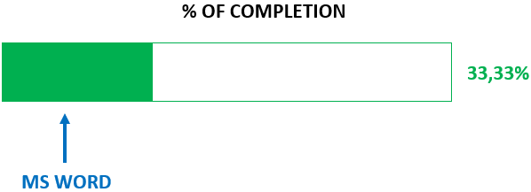

> [!IMPORTANT]
> Content creation for this skill is ongoing

## MS WORD
In this [folder](/MS%20OFFICE%20SUITE/MS%20WORD/) I've got 4 files. If you would like to check these files, you can simply press the "." keyboard button. You'll be navigated to web VS Code version. Afterwards, right click on "MS WORD" folder and then click on "Download" option.
Below is a list explaining what does each file do:
":heavy_check_mark:**LARGE LANGUAGE MODEL.docx**": In this file I demonstrate the majority of my skills in MS WORD. 
> [!WARNING]
> Once you open this file, you'll be asked to enter a specific code in order to view its contents. The code is: **12345**
- "**LARGE LANGUAGE MODEL.pdf**": In this file I demonstrate my skill of converting a WORD file into PDF.
> [!WARNING]
> Once you open this file, you'll be asked to enter a specific code in order to view its contents. The code is: **123456**
- "**ENGLISH CONTENT.docx**" + "**TRANSLATED IN GERMAN CONTENT.docx**": In these files I demonstrate my skill in translating a WORD document into another language. In this particular case, I'm translating from English to German.
":white_check_mark: Don't forget to water the plants today."